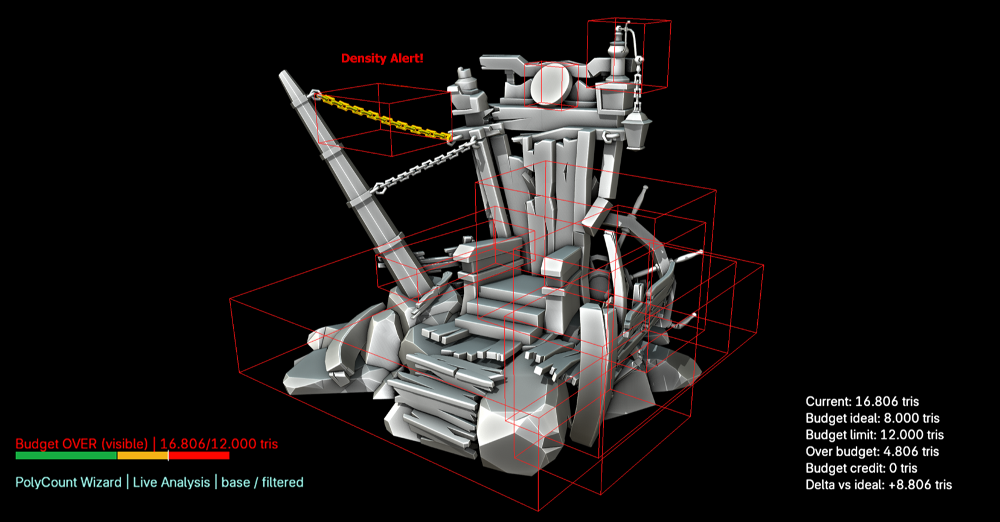

[polycount_wizard_readme.md](https://github.com/user-attachments/files/27550710/polycount_wizard_readme.md)
# PolyCount Wizard

  

  <strong>Real-time Production Tool for Mesh Budget Diagnostics</strong>

  A production-facing Blender tool for mesh budget diagnostics, visual density review, and object-level asset validation.

---

## Overview

PolyCount Wizard helps artists, technical artists, and production teams understand mesh budget risk directly inside Blender.

It is not just a polygon counter. The tool is designed to make scene complexity, object density, modifier impact, and budget status easier to read during production review.

The goal is to give artists clearer technical feedback before mesh density becomes a late-stage production problem.

## Why it exists

Production artists often need to balance visual quality with technical constraints. Raw polygon counts alone do not explain where risk is coming from, which objects are responsible, or what should be reviewed first.

PolyCount Wizard focuses on turning mesh budget information into something more readable, visual, and actionable.

## Core goals

- Make mesh budget diagnostics visible during production work
- Help identify dense objects, budget offenders, and technical risk earlier
- Support more consistent asset review across repeated production passes
- Separate scene-level budget, object-level cost, and visual density signals
- Improve communication between artists and technical reviewers

## Main features

- Real-time mesh budget diagnostics
- Scene density review
- Object-level budget validation
- Visual feedback for dense or high-impact objects
- Modifier-aware review modes
- Budget status and density alert feedback
- Canvas, overlay, and review visualization support
- Settings import/export for repeatable configurations
- English and Portuguese interface support
- Production-oriented UI for artists and technical artists

## Visual documentation

### Interface overview

  

### Production view

  

### Density alert example

  

## Production value

PolyCount Wizard is built around a simple production principle: technical constraints should be readable before they become late-stage problems.

The tool supports:

- Faster technical review
- More consistent mesh budget decisions
- Earlier identification of risk in dense scenes
- Clearer communication between artists and technical reviewers
- Better standardization for asset validation workflows

## Current status

| Area | Status |
|---|---|
| Tool type | Independent production tool |
| Public status | Public documentation |
| Source code | Privately held |
| Main use | Portfolio documentation and production tooling case study |
| Release status | Future release candidate |

This repository currently documents the tool, its purpose, design direction, and production value. Source code and packaged releases may be added later if the tool is prepared for public distribution.

## Design direction

PolyCount Wizard is not intended to be a generic counter script. It is designed as a production review tool.

The tool prioritizes:

- Clear hierarchy of information
- Visual feedback over raw numbers only
- Predictable behavior under production use
- Repeatable review settings
- Artist-readable technical constraints
- Actionable review signals instead of isolated metrics

## Tooling philosophy

A useful production tool should reduce ambiguity, not expose every internal technical detail to the user.

PolyCount Wizard separates technical logic from the artist-facing review experience. The goal is to help users understand what needs attention, why it matters, and where to act.

## Planned documentation

- Installation notes
- Feature overview
- Usage guide
- Screenshot breakdown
- Release notes
- Known limitations
- Roadmap
- Production case study

## Roadmap

- Public documentation pass
- Clean screenshot set
- Demo video integration
- Release notes consolidation
- Known limitations section
- Packaged test build
- Decision on public release, private source, or commercial distribution

## Rights and notice

Designed and developed by Gustavo Henrique Banck.

Source code privately held unless stated otherwise. Public materials in this repository are provided for documentation and portfolio purposes.

## Links

- ArtStation: https://ghbanck.artstation.com
- LinkedIn: https://www.linkedin.com/in/gustavo-banck
- GitHub Profile: https://github.com/ghbanck

